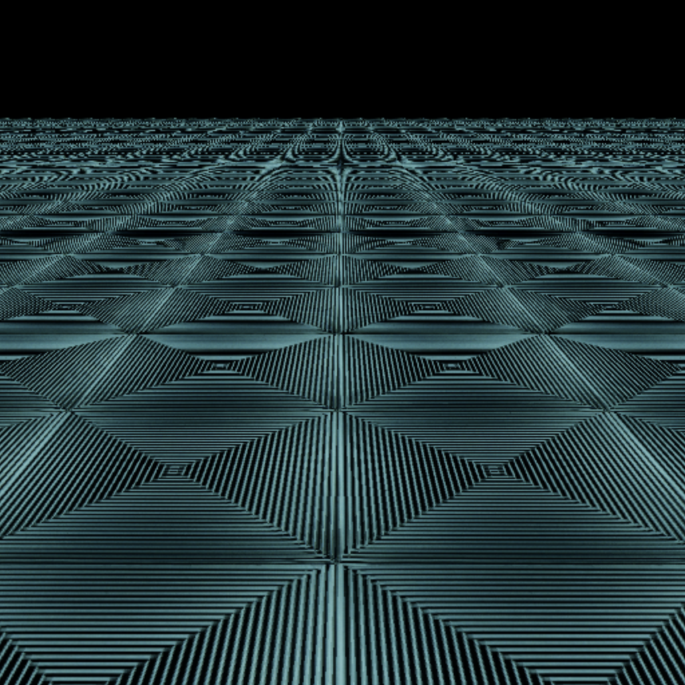
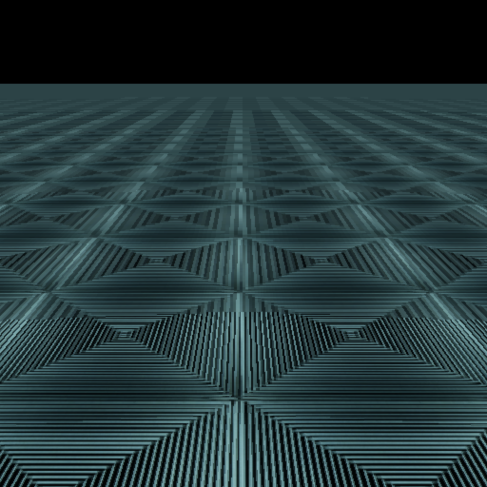

# snippets-mipmap

Uses WebGPU to show how to mip map textures by applying a bilinear filter.

<figure>
    
    <figcaption>Without mip mapping</figcaption>
</figure>

<figure>
    
    <figcaption>With mip mapping</figcaption>
</figure>

`rectmill.png` is a free texture from [Pixar One Thirty](https://renderman.pixar.com/pixar-one-thirty).